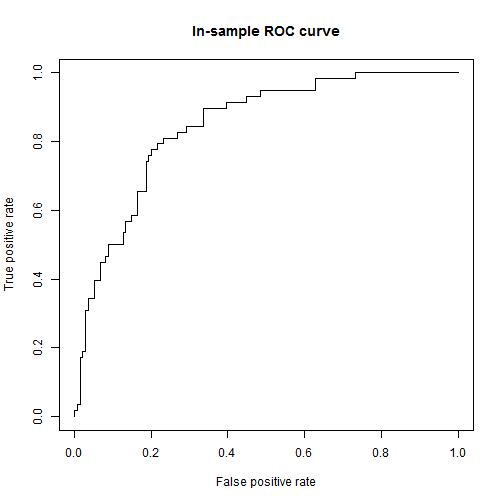

```
## 
## Attaching package: 'faraway'
## 
## The following object is masked from 'package:lattice':
## 
##     melanoma
## 
## The following object is masked from 'package:rpart':
## 
##     solder
```

```
## Warning: package 'ROCR' was built under R version 3.0.3
```

```
## Loading required package: gplots
```

```
## Warning: package 'gplots' was built under R version 3.0.3
```

```
## KernSmooth 2.23 loaded
## Copyright M. P. Wand 1997-2009
## 
## Attaching package: 'gplots'
## 
## The following object is masked from 'package:stats':
## 
##     lowess
```

## Data information
1. Data Source: Pima dataset in "faraway" package in R 
2. Data variables and its attributes:

```
## 'data.frame':	768 obs. of  9 variables:
##  $ pregnant : int  6 1 8 1 0 5 3 10 2 8 ...
##  $ glucose  : int  148 85 183 89 137 116 78 115 197 125 ...
##  $ diastolic: int  72 66 64 66 40 74 50 0 70 96 ...
##  $ triceps  : int  35 29 0 23 35 0 32 0 45 0 ...
##  $ insulin  : int  0 0 0 94 168 0 88 0 543 0 ...
##  $ bmi      : num  33.6 26.6 23.3 28.1 43.1 25.6 31 35.3 30.5 0 ...
##  $ diabetes : num  0.627 0.351 0.672 0.167 2.288 ...
##  $ age      : int  50 31 32 21 33 30 26 29 53 54 ...
##  $ test     : int  1 0 1 0 1 0 1 0 1 1 ...
```

--- 
## Data Exploration

```
##     pregnant        glucose      diastolic        triceps    
##  Min.   : 0.00   Min.   :  0   Min.   :  0.0   Min.   : 0.0  
##  1st Qu.: 1.00   1st Qu.: 99   1st Qu.: 62.0   1st Qu.: 0.0  
##  Median : 3.00   Median :117   Median : 72.0   Median :23.0  
##  Mean   : 3.85   Mean   :121   Mean   : 69.1   Mean   :20.5  
##  3rd Qu.: 6.00   3rd Qu.:140   3rd Qu.: 80.0   3rd Qu.:32.0  
##  Max.   :17.00   Max.   :199   Max.   :122.0   Max.   :99.0  
##     insulin           bmi          diabetes          age      
##  Min.   :  0.0   Min.   : 0.0   Min.   :0.078   Min.   :21.0  
##  1st Qu.:  0.0   1st Qu.:27.3   1st Qu.:0.244   1st Qu.:24.0  
##  Median : 30.5   Median :32.0   Median :0.372   Median :29.0  
##  Mean   : 79.8   Mean   :32.0   Mean   :0.472   Mean   :33.2  
##  3rd Qu.:127.2   3rd Qu.:36.6   3rd Qu.:0.626   3rd Qu.:41.0  
##  Max.   :846.0   Max.   :67.1   Max.   :2.420   Max.   :81.0  
##       test      
##  Min.   :0.000  
##  1st Qu.:0.000  
##  Median :0.000  
##  Mean   :0.349  
##  3rd Qu.:1.000  
##  Max.   :1.000
```

---
## Model development

1.Notice variables glucose,triceps,insulin, bmi etc cannot have zero values.
  Replace Zero by NA.


2. Replace Observation with Missing values.


3. Use Logistic regression to model binary variable test


```
## 
## Call:
## glm(formula = test ~ ., family = binomial, data = pima1)
## 
## Deviance Residuals: 
##    Min      1Q  Median      3Q     Max  
## -2.782  -0.660  -0.364   0.641   2.561  
## 
## Coefficients:
##              Estimate Std. Error z value Pr(>|z|)    
## (Intercept) -1.00e+01   1.22e+00   -8.25  < 2e-16 ***
## pregnant     8.22e-02   5.54e-02    1.48   0.1383    
## glucose      3.83e-02   5.77e-03    6.64  3.2e-11 ***
## diastolic   -1.42e-03   1.18e-02   -0.12   0.9045    
## triceps      1.12e-02   1.71e-02    0.66   0.5113    
## insulin     -8.25e-04   1.31e-03   -0.63   0.5276    
## bmi          7.05e-02   2.73e-02    2.58   0.0099 ** 
## diabetes     1.14e+00   4.27e-01    2.67   0.0076 ** 
## age          3.40e-02   1.84e-02    1.85   0.0647 .  
## ---
## Signif. codes:  0 '***' 0.001 '**' 0.01 '*' 0.05 '.' 0.1 ' ' 1
## 
## (Dispersion parameter for binomial family taken to be 1)
## 
##     Null deviance: 498.10  on 391  degrees of freedom
## Residual deviance: 344.02  on 383  degrees of freedom
## AIC: 362
## 
## Number of Fisher Scoring iterations: 5
```

---
## ROC Curve

ROC Area

```
## [1] 0.8442
```

 
